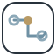

<picture>
  <source media="(prefers-color-scheme: dark)" srcset="./assets/profile-header-dark.svg" />
  <source media="(prefers-color-scheme: light)" srcset="./assets/profile-header-light.svg" />
  
</picture>

<h1 align="center">Hi, I'm Yong</h1>

  <strong>Cross-Platform Software Engineer &amp; Product Builder</strong> 
  <em>Turning complex workflows into reliable software.</em>

  <a href="#engineering-toolbox">Toolbox</a>
  &nbsp;·&nbsp;
  <a href="#projects">Projects</a>
  &nbsp;·&nbsp;
  <a href="#what-i-share">What I share</a>
  &nbsp;·&nbsp;
  <a href="https://www.linkedin.com/in/yong-perrin-75671b405/">LinkedIn ↗</a>

## Engineering across boundaries

<table align="center" width="100%">
  <tr>
    <td align="center" width="33%">
       
      <strong>Cross-language</strong> 
      C# · C++ · Java · Python
    </td>
    <td align="center" width="34%">
       
      <strong>Cross-platform</strong> 
      Windows · Android · iOS · WebGL
    </td>
    <td align="center" width="33%">
       
      <strong>Engine &amp; runtime</strong> 
      Unity · Unreal · Cocos
    </td>
  </tr>
</table>

<table align="center" width="100%">
  <tr>
    <td align="center" width="50%">
       
      <strong>Delivery systems</strong> 
      CI/CD · Automated testing · Diagnostics
    </td>
    <td align="center" width="50%">
       
      <strong>Agent workflows</strong> 
      Responsibilities · Review · Verification
    </td>
  </tr>
</table>

I build where software gets difficult: at the boundaries between languages, runtimes, platforms, delivery environments, and human–agent collaboration.

For 6+ years, I have built CI/CD and automated testing systems, engine tooling, SDKs, plugins, and diagnostics across Unity, Unreal, Cocos, Android, iOS, Windows, and WebGL. Today, I apply the same engineering discipline to AI agent engineering and developer tools: explicit responsibilities, observable execution, independent review, and verifiable completion.

> **AI is an engineering multiplier—not a substitute for software engineering fundamentals.**

  <code>complex workflow → explicit model → reliable system → reusable asset</code>

  
<strong>How these capabilities connect</strong>

   
  <picture>
    <source media="(prefers-color-scheme: dark)" srcset="./assets/capability-topology-dark.svg" />
    <source media="(prefers-color-scheme: light)" srcset="./assets/capability-topology-light.svg" />
    
  </picture>

## Engineering toolbox

  <picture>
    <source media="(prefers-color-scheme: dark)" srcset="./assets/toolbox-dark.svg" />
    <source media="(prefers-color-scheme: light)" srcset="./assets/toolbox-light.svg" />
    
  </picture>

  <strong>Languages:</strong> C# · C++ · Java · Python · JavaScript / TypeScript 
  <strong>Platforms:</strong> Windows · Android · iOS · WebGL 
  <strong>Engines:</strong> Unity · Unreal · Cocos 
  <strong>Systems:</strong> CI/CD · Automated testing · SDKs · Native plugins · Diagnostics · Observability · Agent review workflows

## Projects

### [CrewBee](https://github.com/CrewBeeLab/CrewBee)

CrewBee turns prompts, agents, rules, review flows, and completion criteria into maintainable Agent Team assets. Its built-in Coding Team supports owner-led work, focused implementation, independent review, and evidence-backed completion.

[Website](https://www.crewbee.art) · [Installation](https://github.com/CrewBeeLab/CrewBee/blob/main/docs/guide/installation.md)

### [PilotDeck](https://github.com/PilotDeckAgentLabs/PilotDeck)

PilotDeck is a lightweight ProjectOps × AgentOps console for individual developers and internal teams. It brings projects, runs, events, actions, audit trails, and token costs into one observable operating layer.

### [Waggle](https://github.com/CrewBeeLab/Waggle)

Waggle is a software-first, Project-first governed Agent Harness / Agent Control Plane that turns product software into agent-operable skills. It runs AgentPackages inside Projects with explicit RunPermissionBoundaries, Tool Proxy enforcement, product-owned confirmations, and audit evidence—so teams can ship Agent capabilities without giving up business control.

## What I share

- **Engineering Across Boundaries** — cross-platform integration, SDKs, engine tooling, diagnostics, and lessons from real delivery constraints
- **Reliable Agents in Real Work** — Agent Teams, tool use, review, validation, observability, governance, and failure boundaries
- **From Workflow to Product** — turning ambiguous processes into maintainable systems shaped by evidence and feedback

## How I work

> **Reliable over merely clever. Evidence over claims. Simple paths for simple work. Explicit boundaries for complex systems.**

I care about software that can be understood, tested, reviewed, operated, and improved—not just demonstrated once.

<picture>
  <source media="(prefers-color-scheme: dark)" srcset="https://raw.githubusercontent.com/PerrinYong/PerrinYong/output/github-contribution-grid-snake-dark.svg" />
  <source media="(prefers-color-scheme: light)" srcset="https://raw.githubusercontent.com/PerrinYong/PerrinYong/output/github-contribution-grid-snake.svg" />
  
</picture>

---

  If this is your kind of engineering, follow along.

