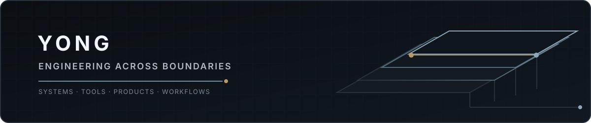
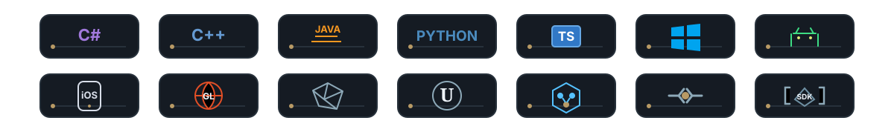

<picture>
  <source media="(prefers-color-scheme: dark)" srcset="./assets/profile-header-dark.svg" />
  <source media="(prefers-color-scheme: light)" srcset="./assets/profile-header-light.svg" />
  
</picture>

  <strong>Cross-Platform Software Engineer · Product Builder</strong> 
  <em>Turning complex workflows into reliable software.</em>
  &nbsp;·&nbsp; <a href="#projects">Projects</a>
  &nbsp;·&nbsp; <a href="#user-content-engineering-toolbox">Toolbox</a>
  &nbsp;·&nbsp; <a href="#user-content-what-i-share">What I share</a>
  &nbsp;·&nbsp; <a href="https://www.linkedin.com/in/yong-perrin-75671b405/">LinkedIn</a>

  <strong>Reliable software across languages, runtimes, platforms, delivery systems, and human–agent workflows.</strong> 
  <kbd>6+ years</kbd>&nbsp;
  <kbd>CI/CD &amp; testing</kbd>&nbsp;
  <kbd>SDKs &amp; tooling</kbd>&nbsp;
  <kbd>Diagnostics</kbd>&nbsp;
  <kbd>Agent engineering</kbd>

<picture>
  <source media="(prefers-color-scheme: dark)" srcset="https://raw.githubusercontent.com/PerrinYong/PerrinYong/output/github-contribution-grid-snake-dark.svg" />
  <source media="(prefers-color-scheme: light)" srcset="https://raw.githubusercontent.com/PerrinYong/PerrinYong/output/github-contribution-grid-snake.svg" />
  
</picture>

<picture>
  <source media="(prefers-color-scheme: dark)" srcset="./assets/toolbox-dark.svg" />
  <source media="(prefers-color-scheme: light)" srcset="./assets/toolbox-light.svg" />
  
</picture>

  <strong>Languages:</strong> C# · C++ · Java · Python · JavaScript / TypeScript &nbsp;·&nbsp; <strong>Platforms:</strong> Windows · Android · iOS · WebGL 
  <strong>Engines:</strong> Unity · Unreal · Cocos &nbsp;·&nbsp; <strong>Systems:</strong> CI/CD · Automated testing · SDKs · Native plugins · Diagnostics · Observability · Agent review workflows

## Projects

### [CrewBee](https://github.com/CrewBeeLab/CrewBee) · `Agent Teams`

CrewBee turns prompts, agents, rules, review flows, and completion criteria into maintainable Agent Team assets. Its built-in Coding Team supports owner-led work, focused implementation, independent review, and evidence-backed completion.

[Website](https://www.crewbee.art) · [Installation](https://github.com/CrewBeeLab/CrewBee/blob/main/docs/guide/installation.md)

### [PilotDeck](https://github.com/PilotDeckAgentLabs/PilotDeck) · `ProjectOps × AgentOps`

PilotDeck is a lightweight ProjectOps × AgentOps console for individual developers and internal teams. It brings projects, runs, events, actions, audit trails, and token costs into one observable operating layer.

### [Waggle](https://github.com/CrewBeeLab/Waggle) · `Agent Control Plane`

Waggle is a software-first, Project-first governed Agent Harness / Agent Control Plane that turns product software into agent-operable skills. It runs AgentPackages inside Projects with explicit RunPermissionBoundaries, Tool Proxy enforcement, product-owned confirmations, and audit evidence—so teams can ship Agent capabilities without giving up business control.

<table align="center" width="100%">
  <tr>
    <td valign="top" width="50%">
      <h3>What I share</h3>
      
<strong>Engineering Across Boundaries</strong> cross-platform integration, SDKs, engine tooling, diagnostics, and lessons from real delivery constraints

      
<strong>Reliable Agents in Real Work</strong> Agent Teams, tool use, review, validation, observability, governance, and failure boundaries

      
<strong>From Workflow to Product</strong> turning ambiguous processes into maintainable systems shaped by evidence and feedback

    </td>
    <td valign="top" width="50%">
      <h3>How I work</h3>
      <blockquote><strong>Reliable over merely clever. Evidence over claims. Simple paths for simple work. Explicit boundaries for complex systems.</strong></blockquote>
      
I care about software that can be understood, tested, reviewed, operated, and improved—not just demonstrated once. AI is an engineering multiplier—not a substitute for those fundamentals.

      <h3>Beyond code</h3>
      
🥋 Martial arts · 🥊 Boxing · 🏀 Basketball 🏹 Archery · 🎾 Tennis

      <h3>Connect</h3>
      

        
        &nbsp;&nbsp;
        
      

    </td>
  </tr>
</table>

---

  If this is your kind of engineering, follow along.

