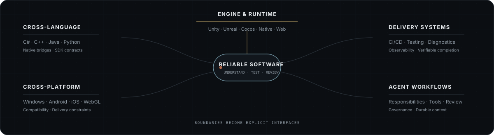
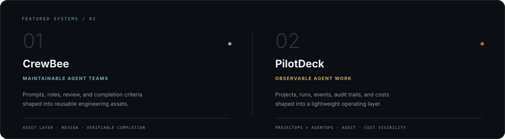
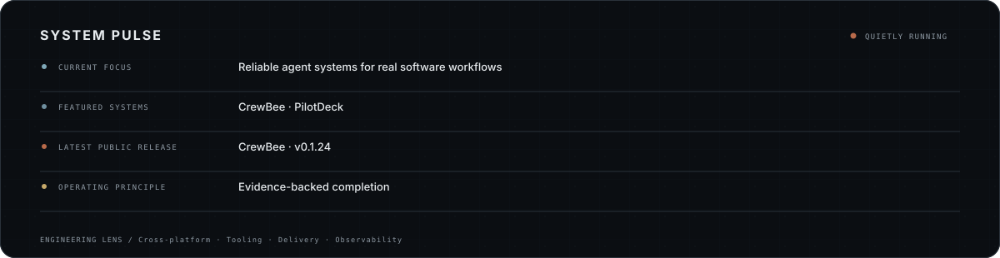

<h1 align="center">Hi, I'm Yong</h1>

  <strong>Cross-Platform Software Engineer &amp; Product Builder</strong> 
  <em>Turning complex workflows into reliable software.</em>

  <a href="https://github.com/CrewBeeLab/CrewBee">CrewBee</a> ·
  <a href="https://github.com/PilotDeckAgentLabs/PilotDeck">PilotDeck</a> ·
  <a href="https://www.crewbee.art">Website</a>

---

I build where software gets difficult: at the boundaries between languages, runtimes, platforms, delivery environments, and human–agent collaboration.

For 6+ years, I have built CI/CD and automated testing systems, engine tooling, SDKs, plugins, and diagnostics across Unity, Unreal, Cocos, Android, iOS, Windows, and WebGL. Today, I apply the same engineering discipline to AI-assisted development: explicit responsibilities, observable execution, independent review, and verifiable completion.

> **AI is an engineering multiplier—not a substitute for software engineering fundamentals.**

## Engineering across boundaries

  

  <code>complex workflow → explicit model → reliable system → reusable asset</code>

## Selected systems

  

  <a href="https://github.com/CrewBeeLab/CrewBee"><strong>CrewBee repository</strong></a> ·
  <a href="https://www.crewbee.art">Website</a> ·
  <a href="https://github.com/CrewBeeLab/CrewBee/blob/main/docs/guide/installation.md">Install</a>
  &nbsp;&nbsp;|&nbsp;&nbsp;
  <a href="https://github.com/PilotDeckAgentLabs/PilotDeck"><strong>PilotDeck repository</strong></a>

Together, they express two sides of the same direction: CrewBee makes Agent Teams maintainable and reusable; PilotDeck makes their work visible, reviewable, and easier to govern.

## System pulse

  

The pulse is generated from a reviewed local configuration plus public GitHub release data. Core profile assets are stored in this repository.

## What I share

- **Engineering Across Boundaries** — cross-platform integration, SDKs, engine tooling, diagnostics, and lessons from real delivery constraints
- **Reliable Agents in Real Work** — Agent Teams, tool use, review, validation, observability, governance, and failure boundaries
- **From Workflow to Product** — turning ambiguous processes into maintainable systems shaped by evidence and feedback

## How I work

> **Reliable over merely clever. Evidence over claims. Simple paths for simple work. Explicit boundaries for complex systems.**

I care about software that can be understood, tested, reviewed, operated, and improved—not just demonstrated once.

  
<strong>Engineering toolbox</strong>

   

  **Languages:** C# · C++ · Java · Python · JavaScript / TypeScript 
  **Platforms:** Windows · Android · iOS · WebGL 
  **Engines:** Unity · Unreal · Cocos 
  **Systems:** CI/CD · Automated testing · SDKs · Native plugins · Diagnostics · Observability · Agent review workflows

---

  If this is your kind of engineering, follow along—or start with <a href="https://github.com/CrewBeeLab/CrewBee">CrewBee</a> and <a href="https://github.com/PilotDeckAgentLabs/PilotDeck">PilotDeck</a>.

